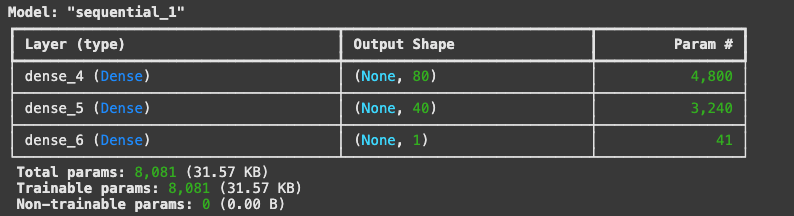
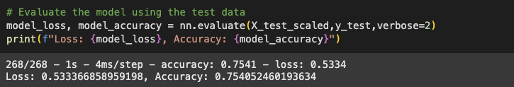
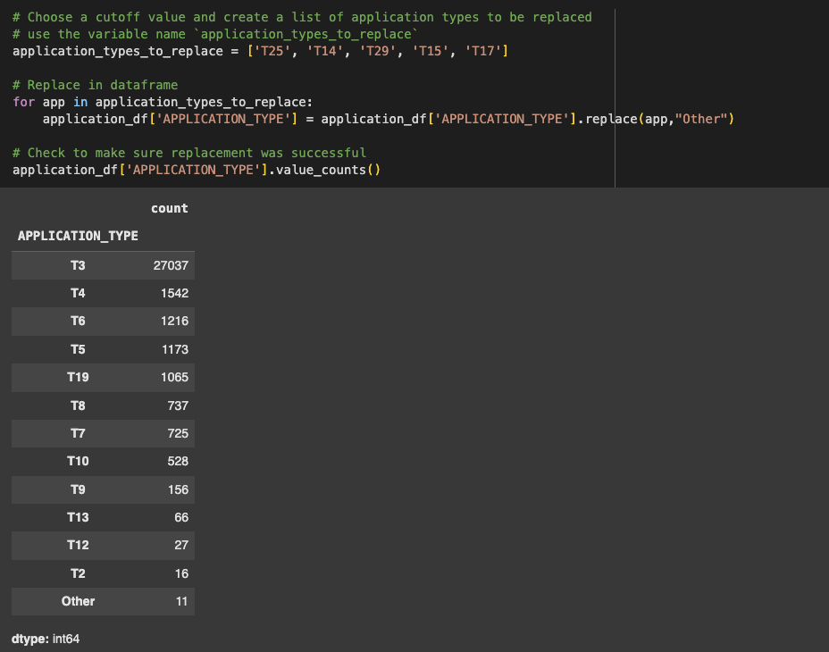
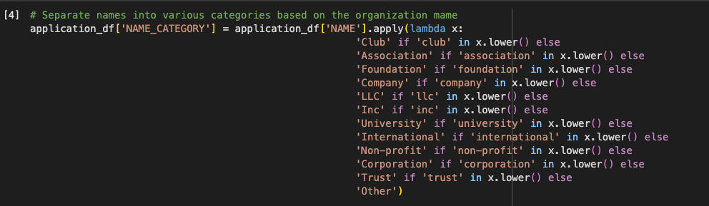

# Overview
The purpose of this analysis was to create a model that would help the nonprofit Alphabet Soup to select funding applicatns in a strategic way. The model is designed to tell Alphabet Soup if the propective applicant will be successful or not in their venture after receiving funds from the organization. 

The final model (AlphabetSoupCharity_Optimization_3.h5) is the model I will be referring to throughout this analysis and discussion.

# Results
## Data Preprocessing
- The Target Variable for this model is IS_SUCCESSFUL. This variable lets us know if any given organization in the dataset who received funding was or was not successful. 
- The Features for the model depended on the Optimization notebook version. In the final model, there were 55 total features that were used. The names of the columns were APPLICATION_TYPE, AFFLIATION, CLASSIFICATION, USE_CASE, ORGANIZATION, STATUS, INCOME_AMT, SPECIAL_CONSIDERATIONS, ASK_AMT, and NAME_CATEGORY. These columns were then separated to binary classification using np.get_dummies() in order to properly scale and analyze the data. After processing, there were 59 total features in the final model. 
- The variables removed were NAME and EIN, both used for specific identification of each organization in the dataset. This information was used for transformation of some columns for model optimization, but the columns themselves were dropped from the dataset before training and fitting the model. They are neither targets nor features. 

## Compiling, Training, and Evaluating the Model
- For the final model, after trial and error, I used 3 total layers - one input and two hidden layers. Fot the input nodes, I used 80 in the first hidden layer and 40 in the second hidden layer. I used only two hidden layers in the final model because in one optimization notebook, I increased to 3 hidden layers without finding significant increase in accuracy. I also did not want to overfit the model. 

- Yes, in the final model, I surpassed target model performance (75%) and was able to achieve 75.4% accuracy. 

- In order to increase model performance, I chose a larger cutoff for the APPLICATION_TYPE column and only grouped Application Types into "Other" that had 10 or fewer occurrences in the dataset. However, the major increase in optimization occurred when I organized the NAME column into various buckets. The more categories I created in this column, the better the model performed. I used this block of code to identify certain keywords in each organization name in order to see if that would help the model better predict if they would be successful or not with Alphabet Soup funding: 

## Summary
Overall, this model is relatively strong and meets the 75% accuracy requirement in place by Alphabet Soup for determining funding for various organization. However, it is certainly not perfect and special consideration should be taken when evaulating applicants who are asking for large amounts of money. 

Another model that could be used to solve this problem would be a logistic regression model, similar to challenge 20. This would also allow us to view predictions for the binary classification, IS_SUCCESSFUL or not. Because logistic regression is used in cases where there are 2 potential outcomes, this would be a good problem to use it with. 